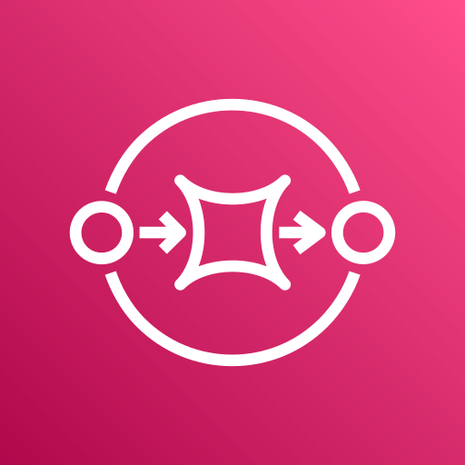
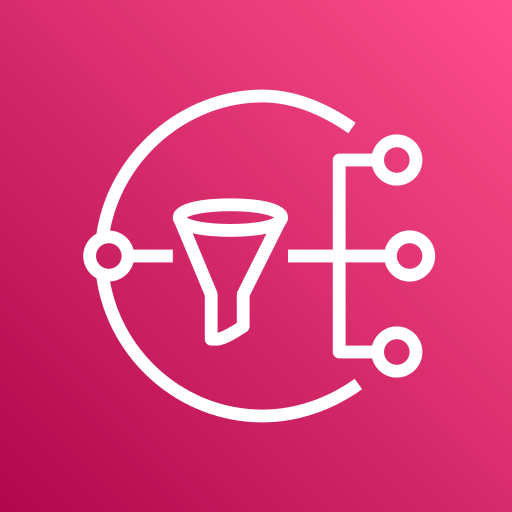
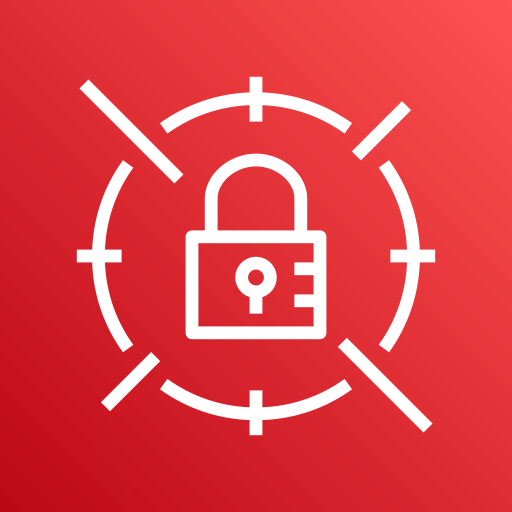
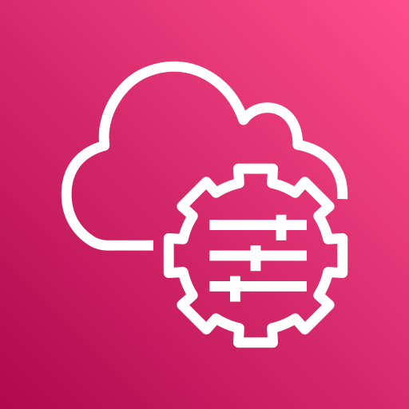

# Jonshua Raul Martinez Chi

## Biografía

Soy una persona creativa y apasionada por encontrar soluciones innovadoras a los desafíos tecnológicos. Fuera del trabajo, soy un fanático del mariachi y el J-pop, amante del café, y disfruto jugando videojuegos de temática RPG o puzzle, así como leyendo manga y novelas ligeras.

Me encanta aplicar Domain-Driven Design (DDD) porque permite crear soluciones alineadas con las necesidades del negocio, facilitando la comunicación entre equipos técnicos y expertos en negocio y asegurando que el software aporte valor real a la organización.

Mi lenguaje de programación favorito es PHP por su simplicidad, facilidad de enseñanza, manipulabilidad y versatilidad. Aspiro a vivir según estos principios, siendo adaptable y siempre dispuesto a apoyar a los demás.

## Habilidades

### Lenguajes de Programación

  <strong> TypeScript &nbsp;</strong>
  <strong> JavaScript &nbsp;</strong>
  <strong> PHP &nbsp;</strong>
  <strong> Python &nbsp;</strong>
  <strong> SQL &nbsp;</strong>
   Java &nbsp;
   Bash &nbsp;
   Shell &nbsp;
   Visual Basic &nbsp;
   C#

### Herramientas y tecnologías

   Git &nbsp;
   Docker &nbsp;
   VS Code &nbsp;
   Makefile &nbsp;
   WSL &nbsp;
   Linux &nbsp;
   Buildspec &nbsp;
   Jira &nbsp;
   Flask &nbsp;
  Composer &nbsp;
  NPM &nbsp;
  Yarn &nbsp;
  pip &nbsp;
  node &nbsp;
  maven &nbsp;
  jest &nbsp;

### Servicios AWS

   AWS &nbsp;
   Lambda &nbsp;
   RDS &nbsp;
   SQS &nbsp;
   SNS &nbsp;
   SES &nbsp;
   Secrets Manager &nbsp;
   Systems Manager &nbsp;
   CodeBuild &nbsp;
   DynamoDB &nbsp;
   API Gateway &nbsp;

### Metodologías

- TDD 🧪
- DDD 🏗️
- BDD 📝
- Scrum 🏃

## Experiencia

### The Palace Company

**Rol:** Ingeniero de software

**Fechas:** jun. 2018 - actualidad

**Responsabilidades y logros:**

La empresa se enfoca en la gestión hotelera. Formé parte del equipo de Servicios Turísticos, que se encarga de la administración de diversas actividades dentro de los hoteles, como spas, campos de golf, tours y otras ventas internas.

Mi participación en el equipo fue completa, abarcando todos los sectores. En los primeros años, trabajé en el desarrollo de aplicaciones web, utilizando principalmente PHP con Yii y JavaScript con una arquitectura MCV.

Estuve participe en la migración de aplicaciones monolíticas a backend con PHP con Phalcon junto a Python con Flask y frontend con Node.js y React. Dentro de esta migracion se realizo el cambio de los sistemas legados de maquina fisica a esta completamente adminstrada en AWS. Se implmento docker para la creacion de contenedores de los diversos sistemas.Debido a la migración se puedo hacer la refactorización de los sistemas y se implemento codigo limpio y buenas practicas de programación.

Despues de la migracion a la nube de todos los sitemas se implementaron agentes de monitoreo para la detección de errores y se implemento un sistema de notificaciones para la detección de errores en los sistemas. Con estas alertas se pudieron reducir la taza de errores como a su vez los soportes a atender.

Gracias a estas herramientas se detectaron problemas con latencia de sistemas externos y se pudieron solucionar median implementacion de REDIS y con proyecciones.

- Sistema Global Sales: Sistema de ventas de reservaciones de hoteles para agencias de viajes. Se la implementancion de sistemas serverless con AWS Lambda con TypeScript y API Gateway para la creacion de servicios de backend utilizando una arquitectura Hexagonal. Se intregro como base de datos DynamoDB y PostgreSQL en RDS. Se implemento un sistema de notificaciones con SNS y SQS para el manejo de eventos de los sistemas. Ahora integrando la metodologia scrum con JIRA para la administracion de tareas y proyectos.

- Sistema Booking Engine: Sistema de reservaciones de hoteles para clientes finales. Trabaje en la refactorización de la aplicación, en cual estaba con un backend en python con flask y un frontend en react. Trabaje en el backend usando la misma tecnologia pero con un enfoque fuerte en SOLID, desarrolle el nuevo flujo de reservaciones con arquitetura serverless con AWS.

Tuve un fuerte impacto en la eleboracion de una plantilla para el nuevo stacks de tegnologias, donde se implemento una arquitectura CLEAN, con un enfoque en la separacion de capas y la implementacion de pruebas unitarias y de integracion. Se implemento DDD para la creacion de servicios y se implemento BDD para la creacion de pruebas de integracion.

- Equipo reservaciones: se implemento la filosofia de producto, donde el objectivo principal es la creacion de un sistema unifcado de reservas (OTAS, GDS, Internos), estuve acargo del equipo donde se abordo el metodo del doble diamante, con el cual se pudo identificar las necesidades que tenemos como empresa y poder generar metrias para la toma de decisiones.
  
### Ozelot Technologies

**Rol:** Desarrollador de aplicaciones Web y Mobil

**Fechas:** may. 2017 - jun. 2018

**Responsabilidades y logros:**

Desarrollé aplicaciones web y móviles utilizando el entorno de desarrollo Visual Studio. Para las aplicaciones web, utilicé ASP.NET y ASP.NET Core 2.0, mientras que para el desarrollo móvil, empleé Xamarin. Además, trabajé en proyectos de domótica, creando aplicaciones para la cría de tilapias y el monitoreo del clima en regiones aisladas. Para estos proyectos, utilicé microcontroladores y el lenguaje de programación Python. Finalmente, utilicé IIS para configurar y administrar servidores basados en Windows.

## Educación

### Universidad Tecnológica de Cancun

**Título:** Licenciado en Ingeniería en Tecnologías de la Información y Comunicación

**Fechas:** 2015 - 2019

## Proyectos

### Sistema Escolar SIU

Este proyecto consistió en el desarrollo de un sistema escolar integral utilizando el framework .NET Core versión 2. El sistema fue diseñado con una arquitectura MVC (Modelo-Vista-Controlador) y se implementó una capa de Business Service para manejar la lógica de negocio más compleja. El sistema fue desarrollado para cubrir todas las necesidades administrativas de una institución educativa, incluyendo la gestión de estudiantes, profesores, cursos, calificaciones, asistencia y más.

Para la persistencia de datos, se utilizó SQL Server. El sistema fue desplegado y administrado utilizando el servidor de aplicaciones IIS (Internet Information Services).

## Contacto

- 
- 
- <a href="mailto:jonshua_97@outlook.com" target="_blank"> jonshua_97@outlook.com</a>
- Numero de telefono: <a href="tel:+529984096750">+52 998 409 6750</a>
