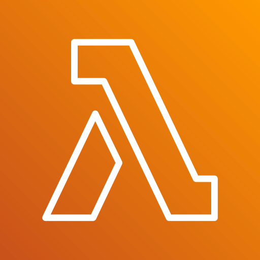
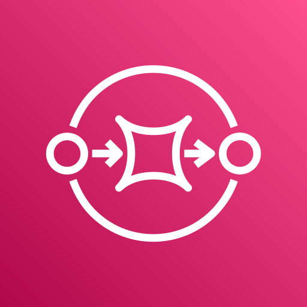
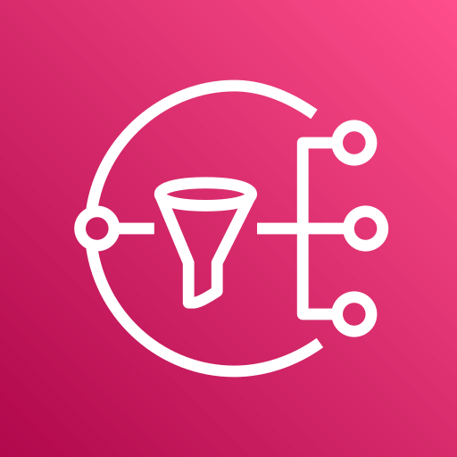
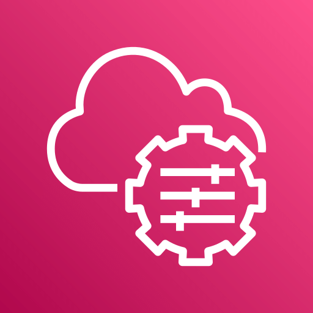
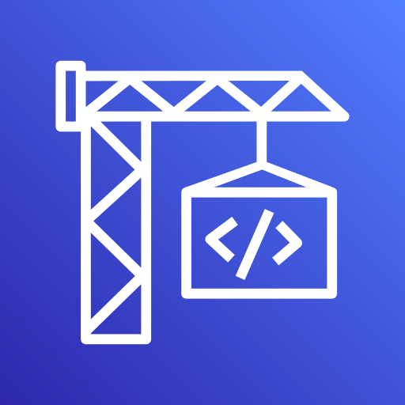
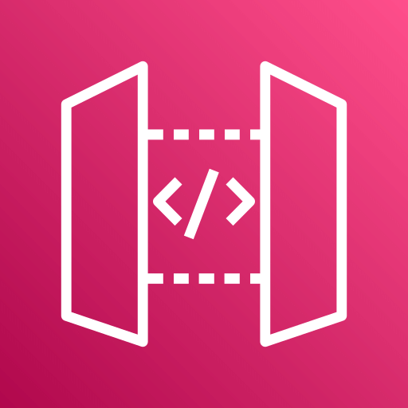

# Jonshua Raul Martinez Chi

## Biography

I am a creative person passionate about finding innovative solutions to technological challenges. Outside of work, I am a fan of mariachi and J-pop, a coffee lover, and enjoy playing RPG or puzzle-themed video games, as well as reading manga and light novels.

I love applying Domain-Driven Design (DDD) because it allows for creating solutions aligned with business needs, facilitating communication between technical teams and business experts, and ensuring that the software delivers real value to the organization.

My favorite programming language is PHP for its simplicity, ease of teaching, manipulability, and versatility. I aspire to live by these principles, being adaptable and always willing to support others.

## Skills

### Programming Languages

  <strong> TypeScript &nbsp;</strong>
  <strong> JavaScript &nbsp;</strong>
  <strong> PHP &nbsp;</strong>
  <strong> Python &nbsp;</strong>
  <strong> SQL &nbsp;</strong>
   Java &nbsp;
   Bash &nbsp;
   Shell &nbsp;
   Visual Basic &nbsp;
   C#

### Tools and Technologies

   Git &nbsp;
   Docker &nbsp;
   VS Code &nbsp;
   Makefile &nbsp;
   WSL &nbsp;
   Linux &nbsp;
   Buildspec &nbsp;
   Jira &nbsp;
   Flask &nbsp;
  Composer &nbsp;
  NPM &nbsp;
  Yarn &nbsp;
  pip &nbsp;
  node &nbsp;
  maven &nbsp;
  jest &nbsp;

### AWS Services

   AWS &nbsp;
   Lambda &nbsp;
   RDS &nbsp;
   SQS &nbsp;
   SNS &nbsp;
   SES &nbsp;
   Secrets Manager &nbsp;
   Systems Manager &nbsp;
   CodeBuild &nbsp;
   DynamoDB &nbsp;
   API Gateway &nbsp;

### Methodologies

- TDD 🧪
- DDD 🏗️
- BDD 📝
- Scrum 🏃

## Experiencia

### The Palace Company

**Role:** Software Engineer

**Dates:** Jun. 2018 - Present

**Responsibilities and Achievements:**

The company focuses on hotel management. I was part of the Tourist Services team, which is responsible for managing various activities within hotels, such as spas, golf courses, tours, and other internal sales.

My involvement in the team was comprehensive, covering all sectors. In the early years, I worked on web application development, mainly using PHP with Yii and JavaScript with an MVC architecture.

I participated in the migration of monolithic applications to a backend with PHP using Phalcon along with Python using Flask, and frontend with Node.js and React. As part of this migration, we transitioned from legacy systems on physical machines to being fully managed on AWS. Docker was implemented for containerizing the various systems. Due to the migration, we were able to refactor the systems and implement clean code and good programming practices.

After migrating all systems to the cloud, monitoring agents were implemented for error detection, and a notification system was set up for error detection in the systems. With these alerts, we were able to reduce the error rate as well as the support needed.

Thanks to these tools, problems with latency from external systems were detected and solved by implementing REDIS and projections.

- Global Sales System: A hotel reservation sales system for travel agencies. Implemented serverless systems with AWS Lambda using TypeScript and API Gateway for creating backend services using a Hexagonal architecture. Integrated DynamoDB and PostgreSQL in RDS as databases. Implemented a notification system with SNS and SQS for event handling in the systems. Now integrating the Scrum methodology with JIRA for task and project management.

- Booking Engine System: A hotel reservation system for end customers. I worked on refactoring the application, which had a backend in Python with Flask and a frontend in React. I worked on the backend using the same technology but with a strong focus on SOLID principles, developing the new reservation flow with serverless architecture on AWS.

I had a significant impact on the creation of a template for the new technology stacks, where a CLEAN architecture was implemented, focusing on layer separation and the implementation of unit and integration tests. DDD was implemented for service creation, and BDD for integration testing.

- Reservations Team: Implemented the product philosophy, where the main objective is the creation of a unified reservation system (OTAs, GDS, Internal). I was in charge of the team where we applied the double diamond method, which allowed us to identify the needs we have as a company and generate metrics for decision-making.
  
### Ozelot Technologies

**Role:** Web and Mobile Application Developer

**Dates:** May 2017 - Jun. 2018

**Responsibilities and Achievements:**

I developed web and mobile applications using the Visual Studio development environment. For web applications, I used ASP.NET and ASP.NET Core 2.0, while for mobile development, I employed Xamarin. Additionally, I worked on home automation projects, creating applications for tilapia farming and climate monitoring in remote regions. For these projects, I used microcontrollers and the Python programming language. Finally, I used IIS to configure and manage Windows-based servers.

## Education

### Universidad Tecnológica de Cancun

**Degree:** Bachelor of Engineering in Information and Communication Technologies

**Dates:** 2015 - 2019

## Projects

### SIU School System

This project involved the development of a comprehensive school system using the .NET Core framework version 2. The system was designed with an MVC (Model-View-Controller) architecture and implemented a Business Service layer to handle more complex business logic. The system was developed to cover all the administrative needs of an educational institution, including management of students, teachers, courses, grades, attendance, and more.

For data persistence, SQL Server was used. The system was deployed and managed using the IIS (Internet Information Services) application server.

## Contact

- 
- 
- <a href="mailto:jonshua_97@outlook.com" target="_blank"> jonshua_97@outlook.com</a>
- Numero de telefono: <a href="tel:+529984096750">+52 998 409 6750</a>
